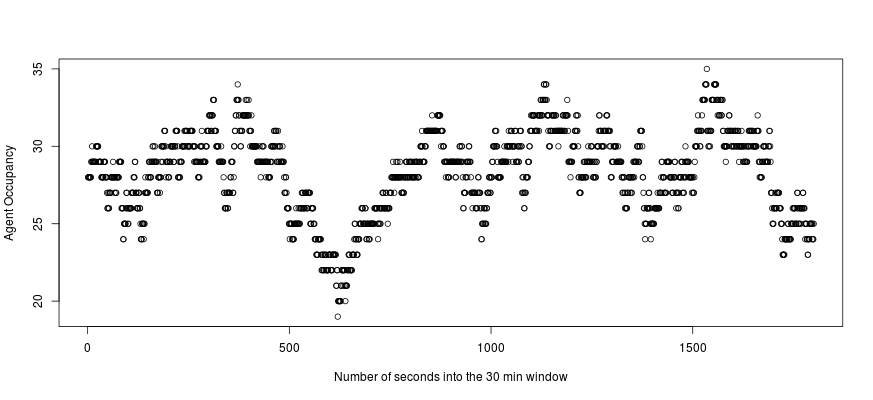

## Introduction

If you have ever stood in line at the supermarket checkouts or hung on the telephone listening to a tune you can't identify waiting to be put through to an agent or stood at the bus stop only for two to arrive at once, you have probably begun to ponder queuing theory. 

Think of any of these situations and you start asking yourself how many checkouts, telephone lines or buses (generically referred to as servers) are needed. What are the criteria on which a decision can be based? What happens if there are fewer servers than needed?

The academic study of queues began in the 1900s and is associated with a Danish telephone engineer A.K.Erlang.

For more information, see http://en.wikipedia.org/wiki/Agner_Krarup_Erlang

The Q-sim app illustrates one of the basic principles on which this study has taken place.

--- .class #id 

## Theory 1

The Q-sim app refers to call centre agents, but could also apply to other servers.

Think of a stream of incoming calls. You have a good idea of the total number of calls that will be received within a given period, say 30 minutes, and the time it will take an agent to handle each call. How many agents' worth of work does that represent? E.g. assume call centre receives 450 calls in a 30 minute window and every call lasts 120s.

```{r}
calls <- 450
avg_dur <- 120
window <-1800
work <- calls * avg_dur / window
print(work)
```

This *work* result is expressed in units called Erlangs and represents how many agents would be required to be exactly 100% busy under the assumptions that calls arrive evenly and are all the same length. But they aren't...

---

## Theory 2

Rather than arrive evenly, calls have a tendency to bunch. Erlang showed that if you consider the time interval between two calls arriving, that variable will have a Poisson distribution.

Likewise, not every call length is identical. If incoming traffic is reasonably homogeneous, the lengths will be clustered around the mean but there will be a long-tail of more complex enquiries. Armed with these assumptions, we can simulate agent occupancy using the example data.


---

## The app

The example shows at some point 35 agents are required to handle the incoming calls. Compare that with the calculation of 30 Erlangs of work. Therefore it can be seen that if only 30 servers were available then a queue would begin to form. The queue length would then obvious impact on newly arriving calls. 

This app represents a very simple demonstration. In practice, more sophisticated programs exist which allow users to input variables for acceptable waiting times and the probability that callers waiting abandon their attempts.

To try the app yourself go to https://ianreeve.shinyapps.io/Q-sim/

---
